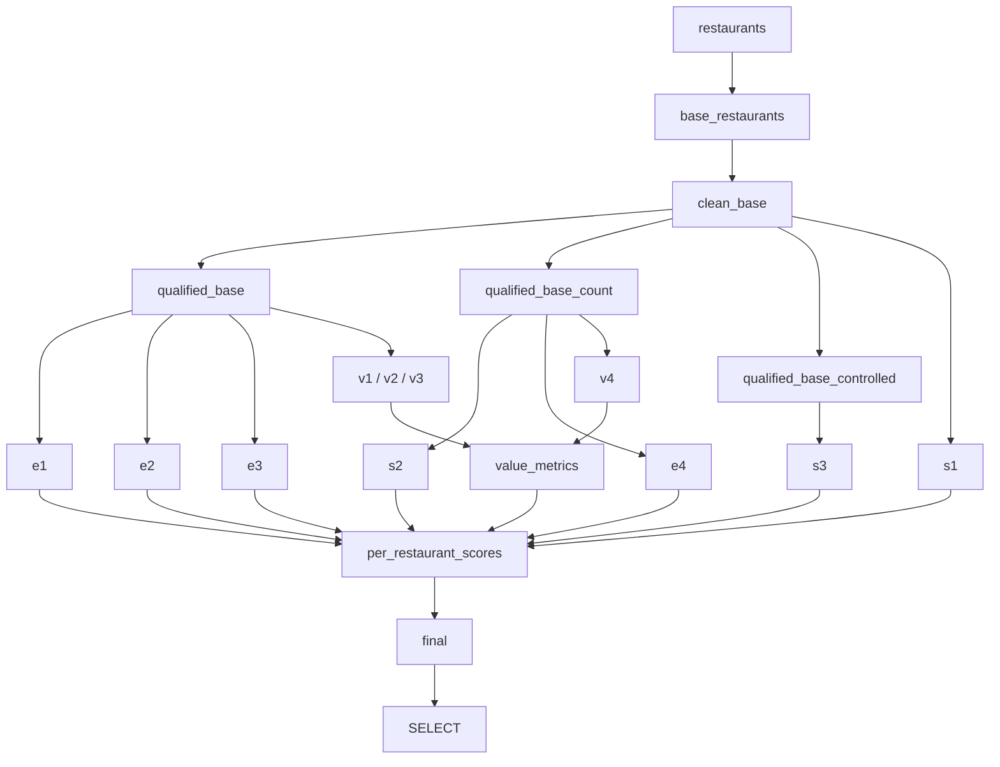

## Metabase Queries — Activation Health Score

This folder contains two **native SQL questions** designed to be pasted directly into Metabase. Together they form the Activation Health Score dashboard.

| File | Role |
|---|---|
| `mart_activation_health_score_metabase.sql` | **Summary list** — one row per restaurant with bucket, total score, and Lock/Key/Ativado flags. |
| `mart_activation_health_score_metabase_metrics.sql` | **Metric detail** — drill-down showing 12 individual metric pass/fail flags for a selected restaurant. |

On the dashboard the summary card acts as the entry point; clicking a restaurant name activates the field filter on the metrics card, revealing which specific milestones that restaurant has (or hasn't) hit.

---

### Metabase setup instructions

#### Summary question

1. Create a **Native question** in Metabase.
2. Paste the entire contents of `mart_activation_health_score_metabase.sql`.
3. No variables are needed — the query runs as-is and returns all restaurants in the 30-day cohort.

#### Metrics question

1. Create a **Native question** in Metabase.
2. Paste the entire contents of `mart_activation_health_score_metabase_metrics.sql`.
3. Metabase will detect the `{{nome_do_restaurante}}` template tag. Configure it as a **Field Filter** mapped to `restaurants.trading_name`.

The query uses this pattern in the `base_restaurants` CTE:

```sql
AND (
    1 = 0
    [[ OR (1 = 1 AND {{nome_do_restaurante}}) ]]
)
```

When no filter value is provided, the `[[ ... ]]` optional block is omitted and the clause reduces to `1 = 0`, which returns **zero rows** (by design — the detail card is only useful when a restaurant is selected). When a value is provided, Metabase injects `restaurants.trading_name = '<value>'` inside the optional block, returning the matching row(s).

#### Dashboard wiring

1. Add both questions to a dashboard.
2. Add a dashboard filter of type **Text** linked to:
   - The summary card's **Trading name** column.
   - The metrics card's `nome_do_restaurante` variable.
3. Clicking a restaurant name in the summary table can then auto-populate the filter and reveal the metrics detail.

---

### Output columns

#### Summary question

| Column | Description |
|---|---|
| Trading name | `restaurants.trading_name` |
| Restaurant ID | `restaurants.id` (UUID) |
| Dias desde cadastro | Days between `restaurants.inserted_at` and today |
| Bucket label | Human-readable label with emoji (e.g. `✅ Green · Activated (>80 + Value Act.)`) |
| Bucket flag | Integer 1–4 for sorting: 1 = Green, 2 = Orange, 3 = Yellow, 4 = Red |
| Total score | Numeric 0–100, sum of all milestone points |
| Completou ≥1 ação de Geração de Valor (Key) | ✅ / ❌ — whether V2, V3, or V4 was hit |
| Lock | ✅ / ❌ — whether total score ≥ 80 |
| Ativado (Lock + Key) | ✅ / ❌ — final activation flag |

#### Metrics question

| Column | Description |
|---|---|
| Trading name | `restaurants.trading_name` |
| Restaurant ID | `restaurants.id` (UUID) |
| Setup · Login gestor | ✅ / ❌ — S1 gestor (1 pt) |
| Setup · Login colaborador | ✅ / ❌ — S1 colaborador (1 pt) |
| Setup · Listas c/ prod. controlado | ✅ / ❌ — S2 (3 pts) |
| Setup · Controlados c/ peso | ✅ / ❌ — S3 (5 pts) |
| Effort · 50 impressões | ✅ / ❌ — E1 (3 pts) |
| Effort · 30 imp. controladas | ✅ / ❌ — E2 (7 pts) |
| Effort · 10 baixas | ✅ / ❌ — E3 (15 pts) |
| Effort · 5 contagens | ✅ / ❌ — E4 (5 pts) |
| Value · 20 impressões c/ peso (shared) | ✅ / ❌ — V1 (15 pts) |
| Value · 30 imp. control. c/ peso | ✅ / ❌ — V2 (10 pts) |
| Value · 5 baixas control. c/ peso | ✅ / ❌ — V3 (25 pts) |
| Value · 2 contagens c/ peso | ✅ / ❌ — V4 (10 pts) |

#### Scoring reference

| Bucket | Metric | Threshold | Points |
|---|---|---|---|
| Setup | S1 – Login gestor | ≥ 1 login `restaurant_admin` | 1 |
| Setup | S1 – Login colaborador | ≥ 1 login `restaurant_employee` | 1 |
| Setup | S2 – Listas c/ controlado | ≥ 2 inventory lists, each with ≥ 1 controlled product | 3 |
| Setup | S3 – Controlados c/ peso | ≥ 5 controlled products with weight > 0 | 5 |
| Effort | E1 – 50 impressões | ≥ 50 total prints (production + receivings) | 3 |
| Effort | E2 – 30 imp. controladas | ≥ 30 controlled-product prints | 7 |
| Effort | E3 – 10 baixas | ≥ 10 write-offs (`tags_count_removed`) | 15 |
| Effort | E4 – 5 contagens | ≥ 5 completed inventories | 5 |
| Value | V1 – 20 imp. c/ peso | ≥ 20 prints with weight (shared products) | 15 |
| Value | V2 – 30 imp. ctrl c/ peso | ≥ 30 controlled prints with weight | 10 |
| Value | V3 – 5 baixas ctrl c/ peso | ≥ 5 controlled write-offs with weight | 25 |
| Value | V4 – 2 contagens ctrl c/ peso | ≥ 2 completed inventories with ≥ 1 controlled product with weight | 10 |

**Maximum:** Setup 10 + Effort 30 + Value 60 = **100 pts**.

---

### Cohort definition

The `base_restaurants` CTE defines which restaurants appear on the dashboard. It applies two layers of filtering to the `restaurants` table:

**Hygiene filters** — exclude internal/test accounts:
- `deleted_at IS NULL`
- `is_blocked IS FALSE`
- Email not containing `suflex`
- `trading_name` and `company_name` not matching internal keywords (`suflex`, `homolog`, `lab`, `fechado`, `foodcamp`, `restaurante do arthur`, `treinamento`, `produto`, `time`)

**Time-to-Value Window (TTVW):**
- `inserted_at >= CURRENT_DATE - INTERVAL '30 days'`

This means the dashboard always shows only restaurants **onboarded in the last 30 days**. Activity metrics (prints, baixas, contagens, logins) also use a rolling 30-day window on their respective `inserted_at` / `completed_at` columns.

---

### Feature-flag qualified bases

Not all restaurants have all Suflex features enabled. Three different qualified-base CTEs gate which restaurants are evaluated for which metrics:

| CTE | Feature flag (`enable_feature`) | Gates metrics |
|---|---|---|
| `qualified_base` | `production_tags = TRUE` | E1, E2, E3, V1, V2, V3 |
| `qualified_base_count` | `count_products = TRUE` | S2, E4, V4 |
| `qualified_base_controlled` | `controlled_products = TRUE` | S3 |

S1 (logins) requires no feature flag and uses `clean_base` directly.

Restaurants missing a feature flag are excluded from the corresponding metric but still appear in the dashboard (their metric flags will show ❌ and contribute 0 points).

---

### CTE data flow

Both Metabase queries share the same CTE structure. The diagram below shows how data flows from the source `restaurants` table through qualified bases, individual metric CTEs, and into the final scored output.



Metrics that source from `tag_infos` and `tag_infos_receivings` (E1, E2, E3, V1, V2, V3) each have a `*_production` and `*_receivings` sub-CTE whose counts are summed together in the parent metric CTE.

---

### Source tables

| Table | Used by | Role |
|---|---|---|
| `restaurants` | Cohort, final SELECT | Cohort definition (hygiene + TTVW) and `trading_name` for display |
| `access_history` | S1 | Login events per restaurant |
| `authentications` | S1 | Maps login to role (`restaurant_admin` / `restaurant_employee`) |
| `enable_feature` | Qualified bases | Feature flags (`production_tags`, `count_products`, `controlled_products`) |
| `inventory_list` | S2 | Counting lists per restaurant |
| `inventory_list_products` | S2 | Products assigned to each counting list |
| `controlled_products` | S2, S3, V3, V4 | Controlled-product registry per restaurant |
| `products` | S3, V1, V2, V3, V4 | Product master — used for `weight > 0` checks |
| `restaurant_products` | V1, V2, V3 | Shared-product lookup (links `product_id` to `restaurant_id`) |
| `tag_infos` | E1, E2, E3, V1, V2, V3 | Production print/write-off events (`tags_count`, `tags_count_removed`) |
| `tag_infos_receivings` | E1, E2, E3, V1, V2, V3 | Receiving print/write-off events (same columns) |
| `inventory` | E4, V4 | Completed inventories (`completed_at IS NOT NULL`) |
| `inventory_count` | V4 | Individual product rows within an inventory |

---

### Activation buckets and Lock + Key

Each restaurant is assigned to one of four buckets based on its total score and whether the Key condition is met.

| Bucket | Condition | Interpretation |
|---|---|---|
| Green — Activated | Score ≥ 80 **and** Key = TRUE | Full activation: setup done, repeated usage, ROI actions present |
| Orange — False Positive | Score ≥ 80 **and** Key = FALSE | High usage of low-value behaviors without controlled weighted actions; CS should intervene |
| Yellow — At Risk | 40 ≤ score < 80 | Some setup/usage but stalled before closing the value loop |
| Red — Failure | Score < 40 | Minimal or no engagement; onboarding essentially failed |

**Lock** = total score ≥ 80.
**Key** = `has_weighted_controlled_core_action = TRUE`, meaning at least one of V2, V3, or V4 was hit.
**Ativado** = Lock AND Key.

Full definitions: [`docs/concepts.md`](../../../../docs/concepts.md) and [`docs/metrics.md`](../../../../docs/metrics.md).

---

### Known differences vs. canonical mart

| Aspect | Metabase queries | Canonical mart (`DBeaver/mart_activation_health_score.sql`) |
|---|---|---|
| **S1 scoring** | Awards 1 pt for gestor + 1 pt for colaborador **separately**. If only one role logged in, total includes that 1 pt. | Awards 2 pts as a **single block** only when both roles logged in. |
| **S1 total impact** | When both or neither role logged in, totals match. When only one role logged in, Metabase total can be **+1** vs. the canonical mart. | — |
| **Table aliasing** | Metrics query uses **full table names** (`restaurants`, `tag_infos`, etc.) with no short aliases. | Uses short aliases (`r`, `ti`, etc.). |
| **Why full names** | Metabase field filters inject SQL like `restaurants.trading_name = '...'` — the physical table name must appear in the FROM/WHERE clause. | Not applicable (no field filters in DBeaver). |

---

### Maintenance checklist

- **Scoring logic changes**: update **both** Metabase files (`_metabase.sql` and `_metabase_metrics.sql`) and the canonical mart (`DBeaver/mart_activation_health_score.sql`). All three must stay in sync.
- **Adding a new metric**: add it to the relevant qualified base, create a new CTE pair (production + receivings if applicable), wire it into `per_restaurant_scores` with its point multiplier, include it in the `total_score` sum, and add a column to the `final SELECT`.
- **Changing the cohort window**: the 30-day interval appears in `base_restaurants` (signup filter) and in every activity CTE (`inserted_at >= CURRENT_DATE - INTERVAL '30 days'`). Update all occurrences.
- **Changing hygiene filters**: update the `base_restaurants` CTE in all three files.
- **Cross-references**: viability status is tracked in [`docs/metrics.md`](../../../../docs/metrics.md); the YAML spec lives in [`docs/references/activation_health_score.yml`](../../../../docs/references/activation_health_score.yml).
